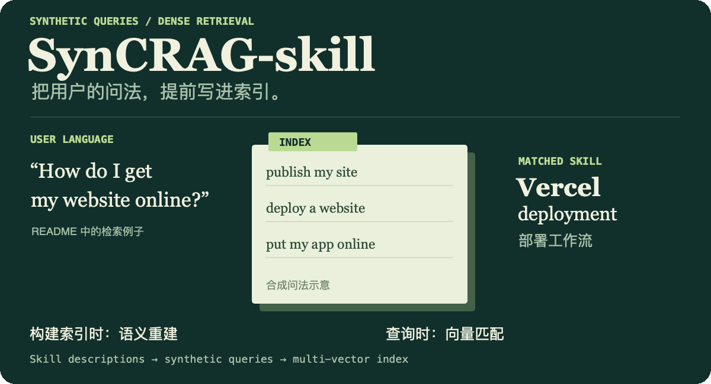

<p align="center">
  
</p>

# SynCRAG-skill

A skill-retrieval research project: generate synthetic user queries when building the index, then rank skills with dense vectors at runtime. The Python API retains the `SkillGraph` name.

**Explore:** [index builder](scripts/build_multi_vector_index.py) · [evaluation](evals/eval_multi_vector.py) · [Python package](skill_graph/)

> **LLM-for-Index, Zero-Token Runtime**: One-time semantic reconstruction for scalable skill retrieval in LLM agents.

---

## TL;DR

- **Problem**: 34,396 real-world skill descriptions are **semantically incomplete**---written in function-oriented language, while users query in task-oriented language.
- **Solution**: LLM generates 10 diverse synthetic user queries per skill, building a **multi-vector index** that bridges the semantic gap.
- **Result**: **71.0% Recall@10** at **22 ms** with **zero runtime tokens**, surpassing UCSB Agentic (68.3%, ~seconds, ~5K tokens).

---

## The Semantic Gap

A real example from our dataset:

| User Query | Skill Description |
|-----------|-------------------|
| "How do I get my website online?" | "Vercel deployment workflow: serverless function configuration, edge caching, and CI/CD pipeline integration." |

**No shared keywords. Low cosine similarity. Same task.**

This is not a vocabulary problem---it's a **pragmatic distributional mismatch**. Skill descriptions across the entire ecosystem share three structural deficiencies:

1. **Function-oriented, not task-oriented**: Explain what the tool does technically, not what problems it solves.
2. **Template-like and homogeneous**: Similar patterns limit coverage of diverse user expressions.
3. **Missing usage scenarios**: Critical context like "when a new team member joins" is entirely absent.

---

## Architecture: Two-Phase Design

```
┌────────────────────────────────────────────┐
│  PREPROCESSING PHASE (one-time, token-acceptable)   │
├────────────────────────────────────────────┤
│  34,396 Skills → LLM SynQ Gen → 10 queries/skill     │
│                     → Embed (all-MiniLM-L6-v2)        │
│                     → Multi-Vector Index stored       │
│  Cost: ~$765 (one-time)                               │
└────────────────────────────────────────────┘
                          │
                          ▼
┌────────────────────────────────────────────┐
│  RUNTIME PHASE (per-query, zero-token)                │
├────────────────────────────────────────────┤
│  User Query → Embed → Dot Product (skill_emb +       │
│              syn_emb) → Top-k Ranking                  │
│  Latency: 22 ms  ·  Runtime Tokens: 0               │
└────────────────────────────────────────────┘
```

---

## Quick Start

```bash
# Clone and install
git clone https://github.com/EricLeeK/SynCRAG-skill.git
cd SynCRAG-skill
uv pip install -e ".[dev]"

# Run evaluation
python evals/eval_multi_vector.py
```

### Python API

```python
from skill_graph import SkillGraph

sg = SkillGraph(
    skills_path="data_real/skills_ucsb_34k.jsonl",
    index_path="data/index/multi_vector_index.pkl",
)

result = sg.retrieve("Deploy a microservice to Kubernetes", top_k=5)
for skill in result.skills:
    print(f"{skill.name}: {skill.description}")
```

### FastAPI Server

```bash
uvicorn skill_graph.api.server:app --reload
```

---

## Repository-reported evaluation

These are the evaluation figures documented by this repository. Consult the evaluation scripts, dataset configuration, and original experiment records when reproducing or comparing them.

### SkillsBench (87 tasks on 34,396 UCSB skills)

| System | Recall@10 | Latency | Runtime Tokens |
|--------|-----------|---------|----------------|
| **Dense + SynQ (ours)** | **71.0%** | **22 ms** | **0** |
| Dense baseline (ours) | 62.8% | 3.2 ms | 0 |
| UCSB Agentic | 68.3% | ~seconds | ~5,000 |
| **SynQ Improvement** | **+8.1pp** | — | — |

**Key findings**:
- Synthetic queries provide **+8.1pp** improvement over dense retrieval on raw descriptions.
- Surpasses UCSB Agentic (68.3%) by **+2.7pp** while being **136x faster** with **zero runtime tokens**.
- The entire runtime is a single vector operation: no LLM calls, no API costs.

---

## Project Structure

```
skill_graph/
├── api/
│   ├── skill_graph.py    # Core API: multi-vector dense retrieval
│   └── server.py         # FastAPI service
├── core/
│   ├── graph.py          # Skill graph manager
│   └── sre.py            # Skill refinement engine
├── matching/
│   ├── hybrid_ranker.py  # Semantic + keyword boost
│   └── keyword_matcher.py# Exact keyword matching
└── models.py             # Pydantic data models
evals/
├── eval_multi_vector.py   # 5-Fold CV evaluation
└── eval_skillsbench.py    # SkillsBench evaluation
scripts/
└── build_multi_vector_index.py  # Build SynQ index
```

---

## Market Argument: Platform-Owned Semantic Reconstruction

We argue that the one-time semantic reconstruction (synthetic query generation) is best performed by **skill marketplace platforms** (e.g., OpenAI's GPT Store, GitHub's skill registries) rather than individual agent developers.

**Why?**
- **Universal inadequacy**: All 34K skills exhibit the same description deficiencies---it is systemic, not individual.
- **Positive externality**: A platform generates SynQ once, every downstream agent benefits.
- **Economies of scale**: ~$765 for 34K skills is modest for a platform, prohibitive for individual developers.

This creates a natural division of labor: **platforms invest in semantic quality, agents enjoy zero-token retrieval**.

---

## Research manuscript

Manuscript sources are in [`paper/`](paper/). A verified publication identifier has not been provided.

---

## Authors

- **Shiyao Li** - Central South University, Changsha, China ([shiyaol492@gmail.com](mailto:shiyaol492@gmail.com))
- **Jiale Zhang** - School of Mechanical Engineering, Hefei University of Technology, Hefei, China ([zhangruoshui2023@163.com](mailto:zhangruoshui2023@163.com))

## License

MIT License.

<details>
<summary>Static overview</summary>

[Open the static SVG](./assets/readme/hero.svg).

</details>
